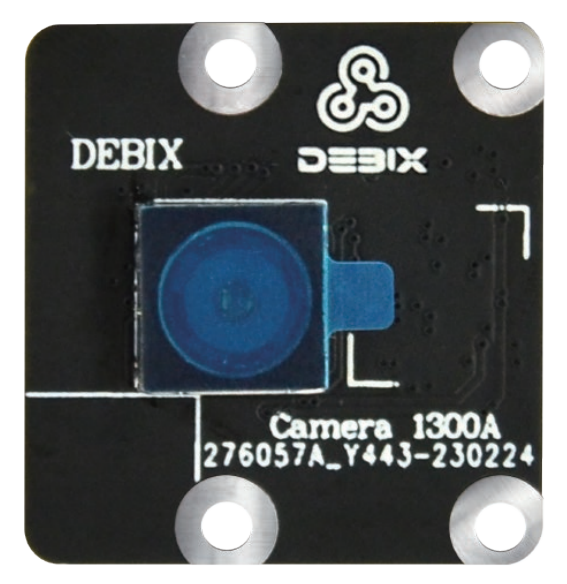
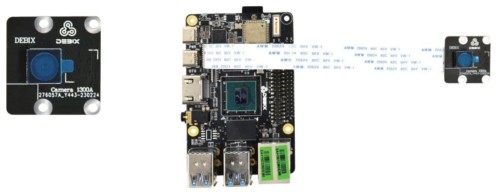
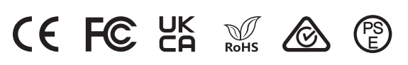
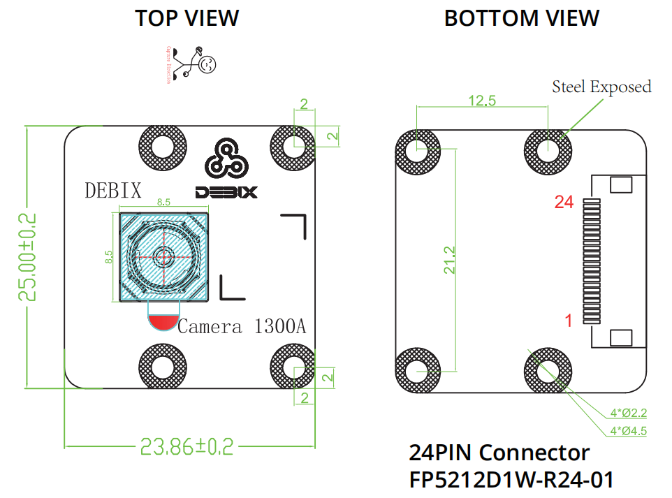

# DEBIX Camera 1300A Module
 

## Overview
DEBIX Camera 1300A Module is a compact HD camera for DEBIX SBCs with a 13MP sensor and 5P + 1IR lens. Featuring a diagonal FOV of 80° and higher still resolution, it supports 4208 x 3120 video mode at 30fps, enabling your DEBIX SBCs to see more of the world. As with the Camera 500A, Camera 1300A is set to support fast focusing functionality by default, and both of them can be set to support fixed focus.

## Main Features:
- 13 megapixels still resolution, three video modes: 4208 x 3120/30fps, 3840 x 2160/30fps, 1920 x 1080/60fps
- 80 degrees diagonal FOV, 69 degrees horizontal FOV, 54 degrees vertical FOV
- Focusing for default, and it could be changed to fixed focus

## Compatibility:
- Compatible with DEBIX Model A, DEBIX Model B, DEBIX Infinity and DEBIX R3576-01
- Support for use with DEBIX SOM A I/O Board through an add-on board

## Specification
| Camera 500A     |                              |
|-----------------|------------------------------|
| Still Resolution| 13 megapixels                |
| Video Mode      | 4208 x 3120/30fps 3840 x 2160/30fps 1920 x 1080/60fps    |
| Sensor          | AR1335                       |
| Sensor Resolution | 4208 x 3120 pixels         |
| Sensor Image Area | 4.629mm x 3.432mm          |
| Pixel Size      | 1.1μm x 1.1μm                |
| Optical Size    | 1/3"                         |
| Depth of Field  | Approx 10cm to ∞             |
| Diagonal FOV    | 80 degrees                   |
| Horizontal FOV  | 69 degrees                   |
| Vertical FOV    | 54 degrees                   |
| Focus           | Focusing                     |
| Focal Length    | 3.34mm                       |
| Focal Ratio (F-Stop)  | 2.2                    |
| Maximum Exposure Time (seconds)  |   /         |
| Lens Mount      | N/A                          |
| Size            | 25mm x 24mm x 7.7mm         |
| Gross Weight    | 14g                          |
| Flexible Flat Cable  | 15cm                    |
 
| Camera Lens     |                              |
|-----------------|------------------------------|
| Output Formats  | Raw/YCbCr4:2:2/RGB565        |
| Lens Construction | 5P+1IR                     |
| TV Distortion    | <1%                         |
| Thread          | M6.5 x 0.25P                 |
| IR Filter       | 650±10nm                     |
| S/N Ratio       | 37dB                         |
| Dynamic Range   | 69dB                         |
| Power Supply    | Core: 1.2VDC Analog: 2.7VDC I/O: 3.3VDC   |
| Power Consumption | Operating: 270mW           |
| Temperature Range | Operating Temp.: -30℃~70℃ Storage Temp.: -40℃~85℃ |

## Certificates

## Mechanical Dimension:

## Pin Definition: (24-Pin Description)

|Pin| Definition          |
|---|---------------------|
| 1 | VDD_5V              |
| 2 | VDD_3V3             |
| 3 | VDD_1V8             |
| 4 | CSI-PWD             |
| 5 | CSI-NRST            |
| 6 | CSI-I2C-SDA         |
| 7 | CSI-I2C-SCL         |
| 8 | CSI-SYNC            |
| 9 | CSI-MCLK            |
| 10 | GND                |
| 11 | CSI-DN0            |
| 12 | CSI-DP0            |
| 13 | GND                |
| 14 | CSI-DN1            |
| 15 | CSI-DP1            |
| 16 | GND                |
| 17 | CSI-CKN            |
| 18 | CSI-CKP            |
| 19 | GND                |
| 20 | CSI-DN2            |
| 21 | CSI-DP2            |
| 22 | GND                |
| 23 | CSI-DN3            |
| 24 | CSI-DP3            |

## Contact Us
- **Headquarters**: DEBIX Technology Inc., 8345 Gold River Ct., Las Vegas, NV 89113, USA  
- **Factory**: 5-6/F., East Zone, Shunheda A2 Building, Liqxiandong Industrial Park, XiLi, Nanshan Dist., Shenzhen, China  
- **Email**: info@debix.io  
- **Website**: [www.debix.io](https://www.debix.io)  
- **Community**: [Discord](https://discord.com/invite/adaHHaDkH2)